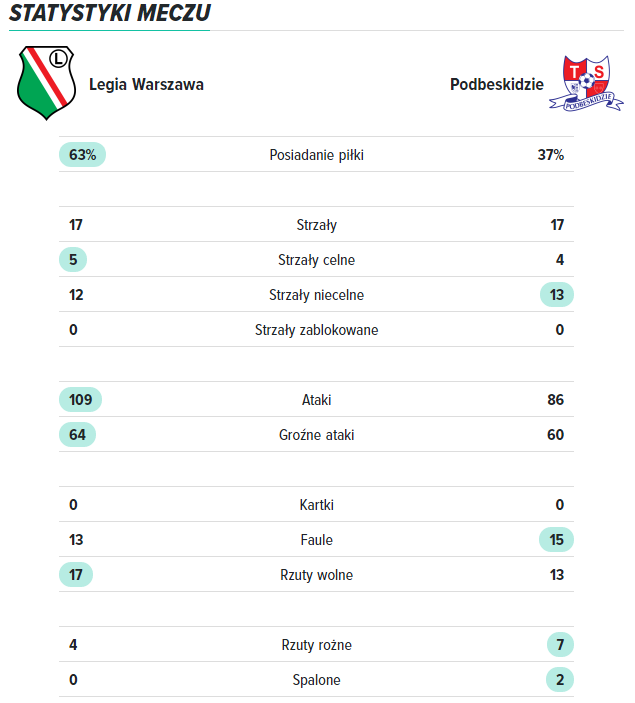
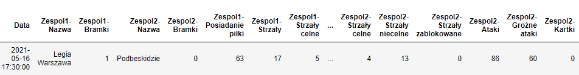
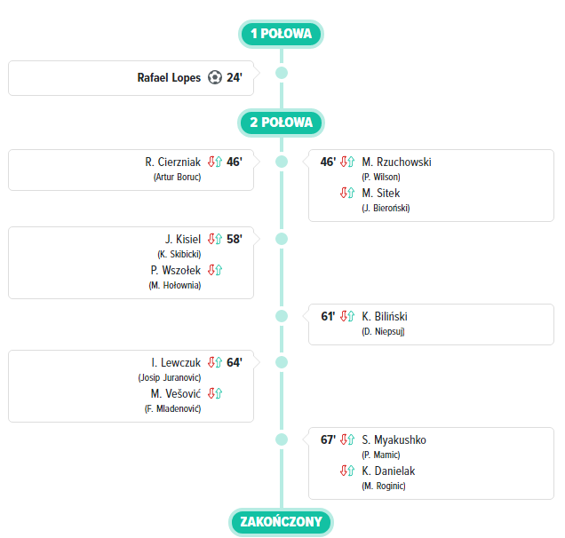
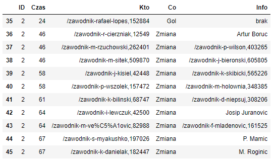
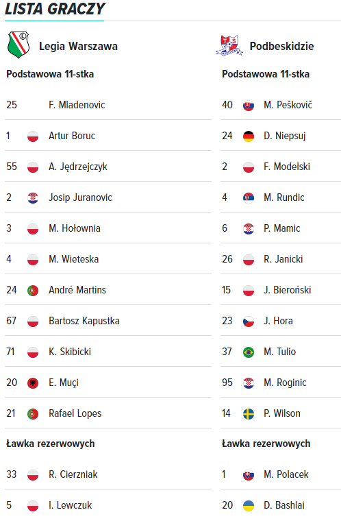
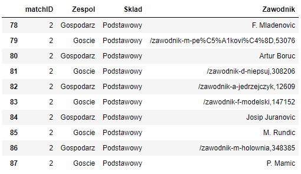
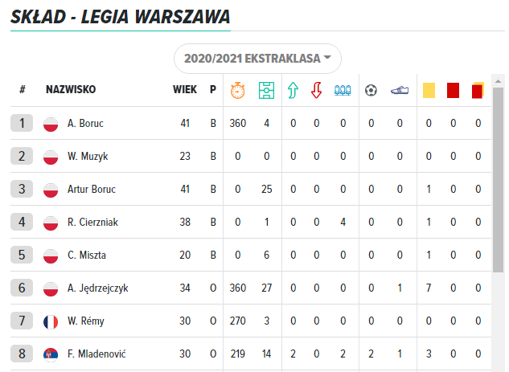
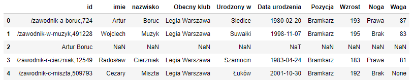

# DataScrapingEkstraklasa

several program that allows to scrape data about football league Ekstraklasa. Data such as players, teams, matches and stuff like that. Data are scraped from polish website meczyki.pl

## Description

This is my school project for subject named data analysis and visualization. In the beginning i have collected data from polish website meczyki.pl. Collected data are divided into four files: 
* Stats.csv       Information about statistics like ball possession, goal attempts and so on. 

view from website:

view of scraped data:

* Summary.csv     Information about all things that occured during match. 

view from website:

view of scraped data:

* Teams.csv       Information lineup with starting lineup and substitutes

view from website:

view of scraped data:

* PlayerList.csv  Information about all players

view from website:

view of scraped data:

## Description Summary
There are total of 3 scripts written using Python. Two dedicated for scraping, and third for data analysis. 

## Getting Started

### Dependencies
I am using Python -> Jupyter Notebook and libraries:

* pandas
* numpy
* requests
* bs4 (BeautifulSoup)
* datetime
* And for analysis i am planning to use dash and plotly

## Authors
Michał Sir
